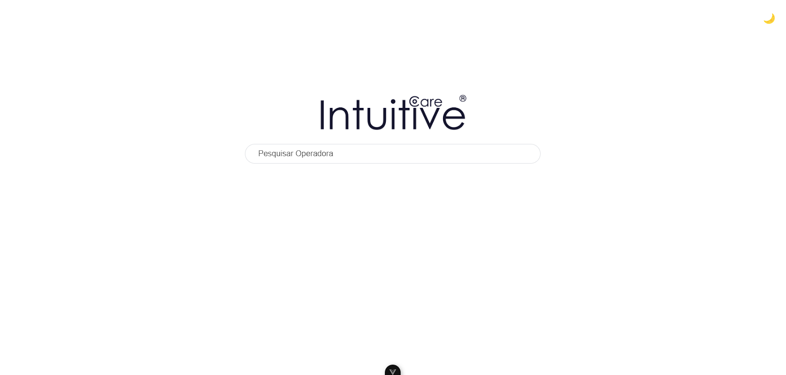
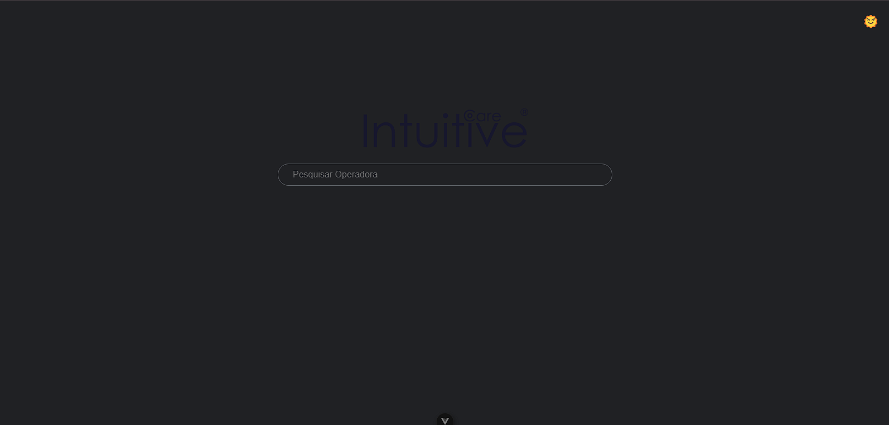
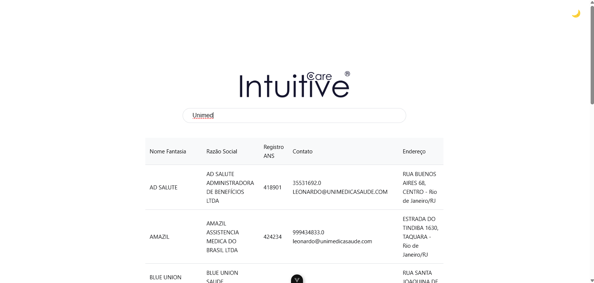

# Testes de Nivelamento - IntuitiveCare

Este repositório contém a solução para o teste de busca de operadoras de saúde usando uma API Flask e frontend Vue 3.

## Teste: API de Busca de Operadoras de Saúde

- **Implementação do Backend (Flask):** Leitura de um arquivo CSV e exposição dos dados via API.
- **Implementação do Frontend (Vue 3):** Interface gráfica moderna e responsiva com pesquisa instantânea.
- **Testes com Postman:** Criação de uma coleção para validar a API.

---

## Tecnologias Utilizadas

- Flask (Python) para o backend.
- Vue 3 com TypeScript para o frontend.
- Axios para requisições HTTP.
- Postman para testes da API.
- Pandas para manipulação de dados no backend.
- Bootstrap e CSS para estilização.

---

## Funcionalidades

- Pesquisa de operadoras de saúde por nome.
- Exibição de resultados paginados e ordenados.
- Alternância entre modo claro e escuro.
- Testes de requisições API via Postman.

---

## Tasks Realizadas

1. **Implementação do Backend (Flask):**
   - Criada uma API que lê um arquivo CSV com dados de operadoras de saúde e realiza consultas baseadas no nome da operadora.
   - Implementado tratamento de erros para diferentes cenários (ex.: arquivo não encontrado, erro de leitura do CSV).

2. **Implementação do Frontend (Vue 3):**
   - Construída uma interface gráfica moderna utilizando Vue 3 e TypeScript.
   - Adicionado sistema de pesquisa com sugestão instantânea (input debounce).
   - Aplicado modo claro e escuro dinâmico.
   - Paginação e ordenação dos resultados de busca.

3. **Testes da API (Postman):**
   - Criada uma coleção no Postman para testar a API.
   - Incluída requisição de busca por nome da operadora.
   - Arquivo utilizado: `Operadoras API.postman_collection.json`.
   - Requisição de exemplo: `http://127.0.0.1:5000/buscar?q=Unimed`.

---
## Estrutura do Projeto


├── 📁 frontend         # Aplicação Vue.js

├── 📁 api          # Aplicação Flask

├── 📁 postman          # Arquivo da coleção Postman

├── 📄 Relatorio_cadop.csv   # Arquivo CSV com dados das operadoras

├── 📄 README.md        # Este arquivo


---

## Como Executar o Projeto

### Backend (Flask)

1. Instale as dependências:
```
pip install flask pandas flask_cors
```
2. Execute o servidor Flask:
```
python app.py
```

### Frontend (Vue 3)

1. Instale as dependências:
```
npm install
```
2. Execute o projeto Vue:
```
npm run dev
```

### Testes no Postman

1. Importe o arquivo `Operadoras API.postman_collection.json` no Postman.
2. Execute a requisição de busca utilizando a URL:
```
http://127.0.0.1:5000/buscar?q=Unimed
```

---

## Prints do Frontend



### Tema Escuro


### Pesquisa em Funcionamento


## Conclusão

Todas as tasks foram concluídas com sucesso. A aplicação está funcional, retornando os dados esperados através da integração entre frontend e backend. Além disso, o projeto foi documentado adequadamente e testado com o Postman.

---


